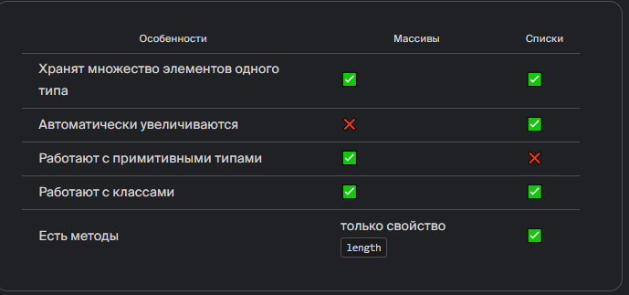

В этой теме ты познакомишься с двумя способами хранения данных — списками и хеш-таблицами.

В программы часто нужно добавлять множество значений: например, имена студентов или названия глав книги. **Структуры данных** (англ. data structures) задают правила, по которым такие значения хранятся и взаимодействуют.

Структура данных — это:

- набор данных;
- отношения между ними;
- функции и методы, которые помогают управлять данными.

Тебе уже знакома одна структура данных — массив. Он состоит из элементов с индексами.

Например, массив `expenses` в финансовом приложении хранит траты за неделю:
```
double[] expenses = new double[7]; 
```

Представь, что в приложении нужно хранить данные за несколько лет. Понадобится массив с большим количеством значений — например, 1000:
```
double[] expenses = new double[1000]; 
```

В какой-то момент и этого количества может не хватить, а размер массива нельзя изменить.

Можно создать другую структуру данных — **список** (англ. list). Списки тоже помогают хранить элементы одного типа.

Список отличается от массива тем, что его размер автоматически увеличивается, когда ты добавляешь новые значения.

### Создание списков

В Java есть несколько классов для списков. Один из них — `ArrayList` (англ. «список на основе массива»). Он входит в стандартную библиотеку Java.

Сначала нужно импортировать класс `ArrayList`:
```
import java.util.ArrayList; // импортировали класс ArrayList

public class Praktikum {
      public static void main() {
    // теперь можно создать список
      }
} 
```

Чтобы объявить список, в угловых скобках `<>` нужно указать класс, объекты которого он будет содержать.

Список может работать только со ссылочными типами. Примитивные типы нужно заменить на обёртку: например, `double` — на `Double`.

Список расходов можно объявить так:
```
ArrayList<Double> expenses; 
```

Теперь нужно создать новый объект. Понадобятся и угловые, и круглые скобки. Размер списка указывать не нужно:
```
ArrayList<Double> expenses = new ArrayList<>(); 
```

Класс `ArrayList` умеет работать с объектами разных типов. Например:
```
ArrayList<String> names = new ArrayList<>(); // список имён
ArrayList<Integer> counts = new ArrayList<>(); // список целых чисел
ArrayList<Hamster> hamsters = new ArrayList<>(); // список хомяков 
```

В списке можно хранить даже другие списки:
```
ArrayList<ArrayList<Double>> matrix = new ArrayList<>(); 
```

### Что выбрать: массив или список?

Вспомни: когда ты создаёшь массив, нужно указать его длину. Изменить её уже не получится. Поэтому массивы лучше применять, когда число элементов известно заранее.

В списках указывать размер не нужно: они автоматически увеличиваются, когда добавляешь элементы.

В массивах можно хранить и примитивные, и ссылочные типы, а в списках — только классы. Примитивные типы в списках заменяют на классы-обёртки.

У списков есть удобные методы, поэтому их применяют чаще. Ты узнаешь об этих методах в следующих уроках. У массивов есть только одно свойство — длина `length`.


### Задание 
#### 1
Допиши код: создай список countryNames для названий стран.
Заполнять список пока не нужно.

Без решения
```java
// импортируй пакет ArrayList
...
public class Praktikum {

    public static void main(String[] args) {
        // создай список строк countryNames
		...
    }
}
```

С решением
```java

```

#### 2
